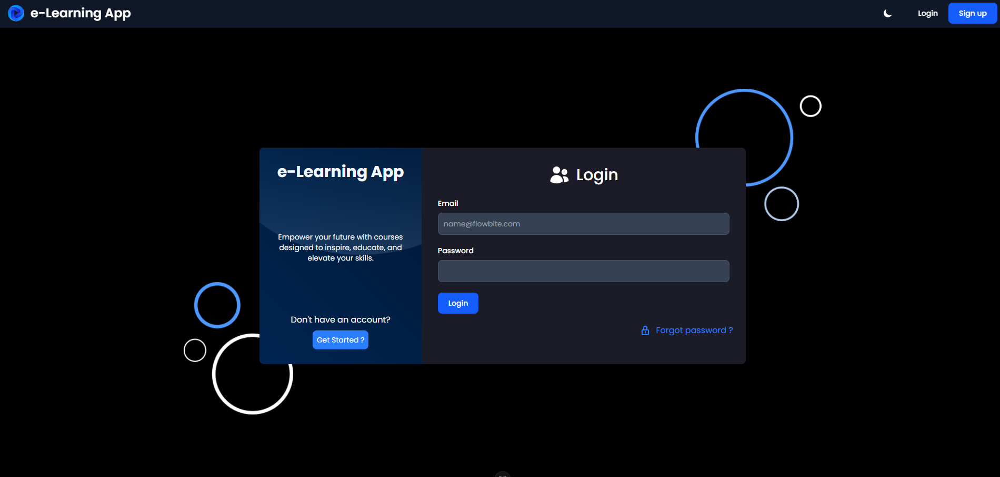
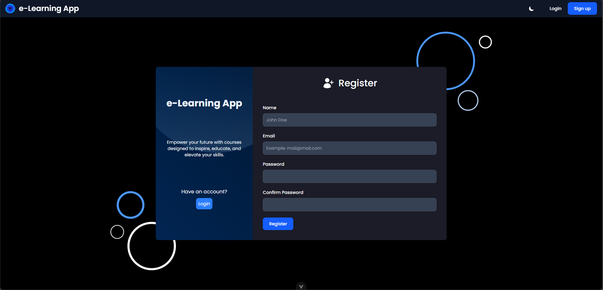
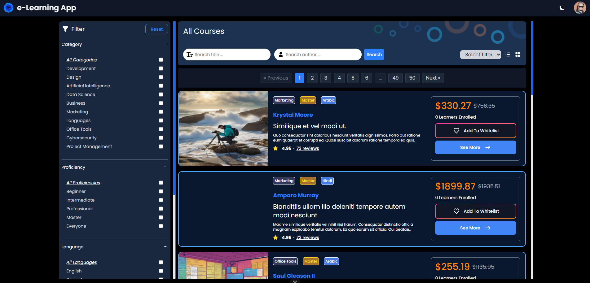
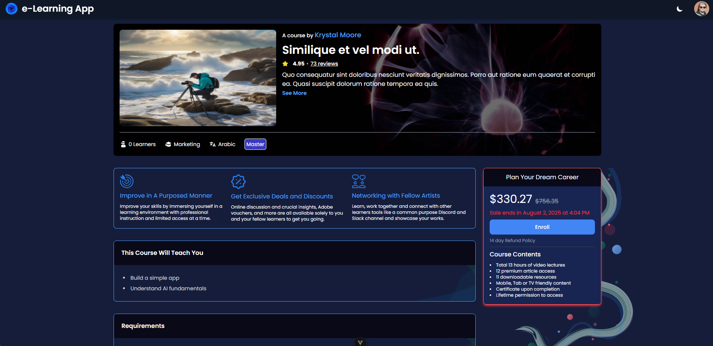
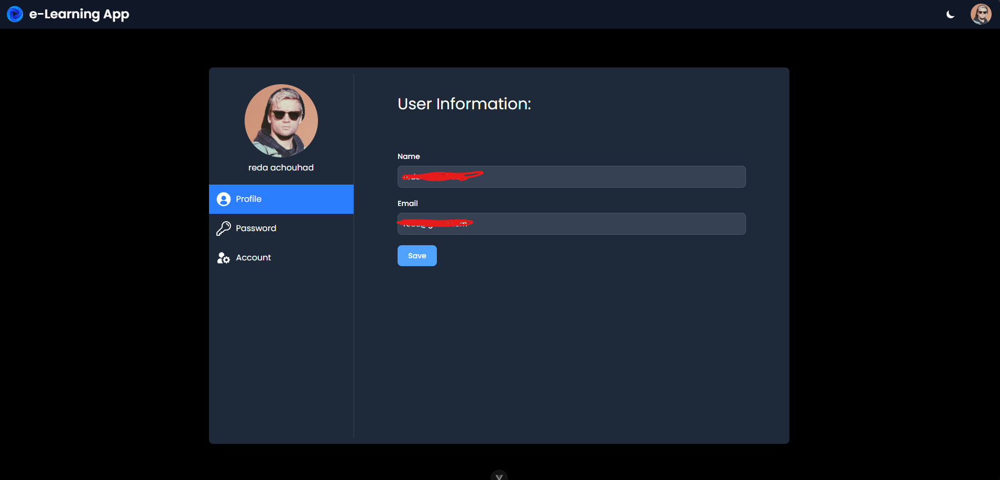
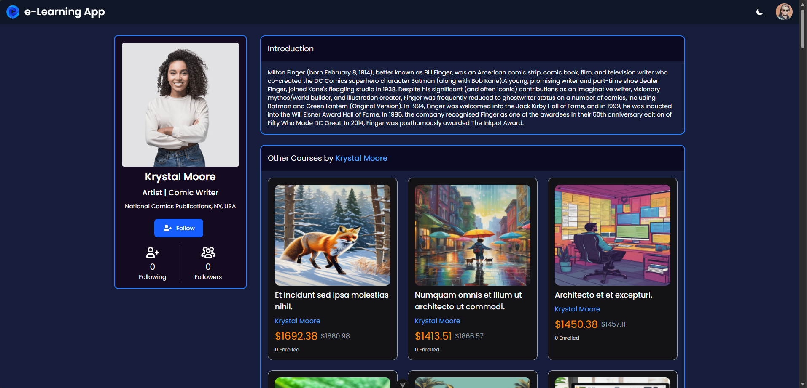
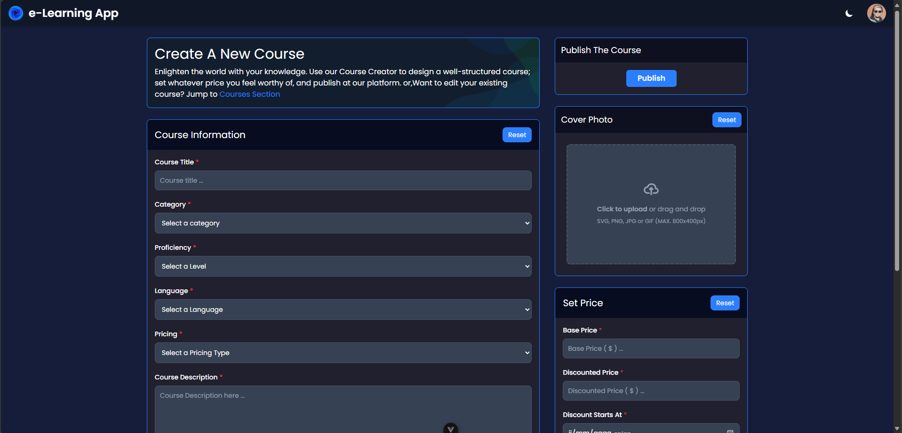

# 🎓 E-Learning Platform

A modern web-based e-learning platform built with **Laravel** and **Vue.js**, designed to simplify online learning and course management for students and instructors.

## Diagram entities/associations


## Login Page



## Register Page



## Courses Pages



## Course Details Page



## Profile User Page



## Trainer / Creator page



## Create Course Page



---

## 🛠 Tech Stack

- **Backend**: Laravel 10
- **Frontend**: Vue.js 3 + Vite
- **Database**: Sqlite
- **Authentication**: Laravel Fortify
- **Styling**: Tailwind CSS
- **Notifications**: Vue Toastification

---

## 📦 Installation

1. **Clone the repository:**

```bash
git clone https://github.com/yourusername/e-learning-platform.git

cd e-learning-platform
```

2. **Backend setup (Laravel):**

```bash
git clone https://github.com/yourusername/e-learning-platform.git

cd e-learning-platform
```

3. **Frontend setup (Vue):**

```bash
cd frontend
npm install
npm run dev
```
